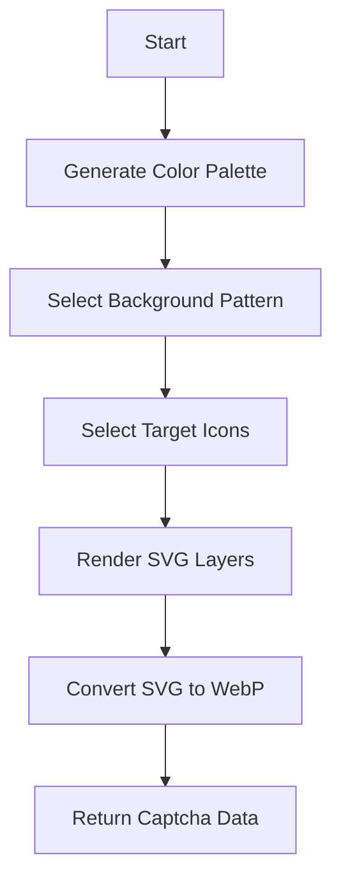
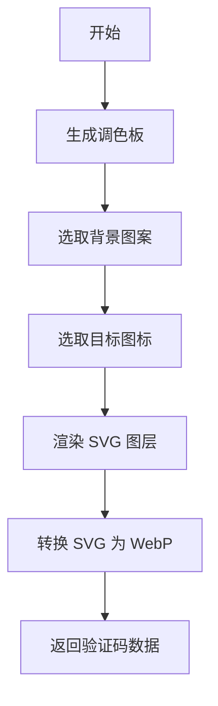

[English](#en) | [中文](#zh)

---

<a id="en"></a>

# svg-captcha : High performance SVG captcha generator

[TOC]

## Introduction

High performance SVG captcha generator. Supports various background patterns, randomized icons, and WebP output. Designed for low latency and high security.

## Usage

Add to your `Cargo.toml`:

```bash
cargo add svg_captcha
```

Example usage:

```rust
use svg_captcha::render;

fn main() {
  // Generate a 300x300 captcha with 3 target icons
  let captcha = render(300, 300, 3).unwrap();

  println!("SVG: {}", captcha.svg);
  println!("WebP size: {} bytes", captcha.webp.len());
  println!("Target icons: {:?}", captcha.icons);
}
```

## Features

- Dynamic SVG background generation with multiple patterns.
- Randomized icon placement and transformations.
- Integrated WebP conversion.
- Minimal dependencies and high performance.

## Design

The generation process follows a pipeline of randomization and rendering.



## Tech Stack

- **Rust**: Core logic and high performance execution.
- **fastrand**: High speed random number generation.
- **resvg / zenwebp**: Efficient conversion from SVG to WebP.

## Directory Structure

- `src/`: Core logic and rendering.
- `src/consts/`: Embedded SVG icons and background patterns.
- `examples/`: Usage examples and server implementation.
- `tests/`: Integration tests.

## API Reference

### `render(w: u32, h: u32, num: usize) -> Result<Captcha>`

Main entry point. Generates SVG and WebP data.

- `w`, `h`: Dimensions.
- `num`: Number of target icons for the user to click.

### `render_svg(w: u32, h: u32, num: usize) -> Captcha`

Generates only SVG content. The `webp` field in the returned struct will be empty.

### `verify(clicks: &[(i32, i32)], positions: &[(i32, i32, u32)]) -> bool`

Validates user clicks against icon positions.

### `Captcha` Struct

- `svg`: SVG string content.
- `webp`: WebP binary buffer.
- `icons`: Names of the target icons.
- `positions`: List of `(x, y, size)` for target icons.

## Trivia

The concept of CAPTCHA (Completely Automated Public Turing test to tell Computers and Humans Apart) was coined in 2003 by Luis von Ahn et al. at Carnegie Mellon University. Early versions relied on distorted text, but as OCR improved, image-based and interaction-based challenges like icon clicking became more popular for better security and user experience.

---

<a id="zh"></a>

# svg-captcha : 高性能 SVG 验证码生成器

[TOC]

## 介绍

高性能 SVG 验证码生成器。支持多种背景模式、随机图标定位以及 WebP 格式输出。旨在提供低延迟、高安全性的验证方案。

## 使用演示

安装依赖：

```bash
cargo add svg_captcha
```

使用示例：

```rust
use svg_captcha::render;

fn main() {
  // 生成 300x300 分辨率、包含 3 个目标图标的验证码
  let captcha = render(300, 300, 3).unwrap();

  println!("SVG: {}", captcha.svg);
  println!("WebP 大小: {} 字节", captcha.webp.len());
  println!("目标图标: {:?}", captcha.icons);
}
```

## 特性

- 动态生成多种模式的 SVG 背景。
- 随机图标选取与变换。
- 集成 WebP 格式转换。
- 极致性能，极低依赖。

## 设计思路

生成流程遵循随机化与多层渲染管线。



## 技术堆栈

- **Rust**: 核心逻辑与高性能执行。
- **fastrand**: 高速随机数生成。
- **resvg / zenwebp**: 高效 SVG 转 WebP。

## 目录结构


- `src/`: 核心逻辑与渲染实现。
- `src/consts/`: 内嵌图标与背景模式数据。
- `examples/`: 使用示例与服务端演示。
- `tests/`: 集成测试。

## API 说明

### `render(w: u32, h: u32, num: usize) -> Result<Captcha>`

主入口函数，生成包含 SVG 和 WebP 的验证码数据。

- `w`, `h`: 画布尺寸。
- `num`: 需要点击的目标图标数量。

### `render_svg(w: u32, h: u32, num: usize) -> Captcha`

仅生成 SVG 内容。返回结构体中的 `webp` 字段将为空。

### `verify(clicks: &[(i32, i32)], positions: &[(i32, i32, u32)]) -> bool`

验证用户点击坐标是否命中目标图标位置。

### `Captcha` 结构体

- `svg`: SVG 字符串。
- `webp`: WebP 二进制缓冲区。
- `icons`: 目标图标名称列表。
- `positions`: 目标图标的 `(x, y, size)` 坐标列表。

## 历史小知识

CAPTCHA（全自动区分计算机和人类的图灵测试）这一术语由路易斯·冯·安（Luis von Ahn）等人于 2003 年在卡内基梅隆大学提出。早期的验证码主要依靠扭曲的文字，但随着 OCR 技术的进步，基于图像识别和交互（如点击图标）的挑战因其更高的安全性和更好的用户体验而逐渐成为主流。
