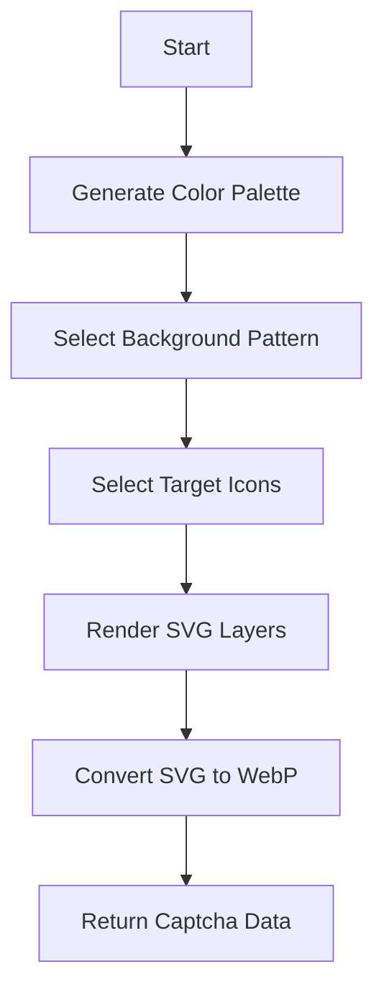

# svg-captcha : High performance SVG captcha generator

[TOC]

## Introduction

High performance SVG captcha generator. Supports various background patterns, randomized icons, and WebP output. Designed for low latency and high security.

## Usage

Add to your `Cargo.toml`:

```bash
cargo add svg_captcha
```

Example usage:

```rust
use svg_captcha::render;

fn main() {
  // Generate a 300x300 captcha with 3 target icons
  let captcha = render(300, 300, 3).unwrap();

  println!("SVG: {}", captcha.svg);
  println!("WebP size: {} bytes", captcha.webp.len());
  println!("Target icons: {:?}", captcha.icons);
}
```

## Features

- Dynamic SVG background generation with multiple patterns.
- Randomized icon placement and transformations.
- Integrated WebP conversion.
- Minimal dependencies and high performance.

## Design

The generation process follows a pipeline of randomization and rendering.



## Tech Stack

- **Rust**: Core logic and high performance execution.
- **fastrand**: High speed random number generation.
- **resvg / zenwebp**: Efficient conversion from SVG to WebP.

## Directory Structure

- `src/`: Core logic and rendering.
- `src/consts/`: Embedded SVG icons and background patterns.
- `examples/`: Usage examples and server implementation.
- `tests/`: Integration tests.

## API Reference

### `render(w: u32, h: u32, num: usize) -> Result<Captcha>`

Main entry point. Generates SVG and WebP data.

- `w`, `h`: Dimensions.
- `num`: Number of target icons for the user to click.

### `render_svg(w: u32, h: u32, num: usize) -> Captcha`

Generates only SVG content. The `webp` field in the returned struct will be empty.

### `verify(clicks: &[(i32, i32)], positions: &[(i32, i32, u32)]) -> bool`

Validates user clicks against icon positions.

### `Captcha` Struct

- `svg`: SVG string content.
- `webp`: WebP binary buffer.
- `icons`: Names of the target icons.
- `positions`: List of `(x, y, size)` for target icons.

## Trivia

The concept of CAPTCHA (Completely Automated Public Turing test to tell Computers and Humans Apart) was coined in 2003 by Luis von Ahn et al. at Carnegie Mellon University. Early versions relied on distorted text, but as OCR improved, image-based and interaction-based challenges like icon clicking became more popular for better security and user experience.
