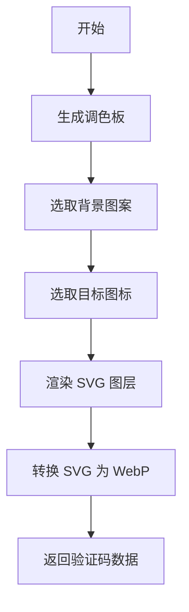

# svg-captcha : 高性能 SVG 验证码生成器

[TOC]

## 介绍

高性能 SVG 验证码生成器。支持多种背景模式、随机图标定位以及 WebP 格式输出。旨在提供低延迟、高安全性的验证方案。

## 使用演示

安装依赖：

```bash
cargo add svg_captcha
```

使用示例：

```rust
use svg_captcha::render;

fn main() {
  // 生成 300x300 分辨率、包含 3 个目标图标的验证码
  let captcha = render(300, 300, 3).unwrap();

  println!("SVG: {}", captcha.svg);
  println!("WebP 大小: {} 字节", captcha.webp.len());
  println!("目标图标: {:?}", captcha.icons);
}
```

## 特性

- 动态生成多种模式的 SVG 背景。
- 随机图标选取与变换。
- 集成 WebP 格式转换。
- 极致性能，极低依赖。

## 设计思路

生成流程遵循随机化与多层渲染管线。



## 技术堆栈

- **Rust**: 核心逻辑实现，保障高性能。
- **fastrand**: 极速随机数生成。
- **svg2webp**: 高效 SVG 转 WebP。
- **hipstr**: 零成本字符串优化。

## 目录结构

- `src/`: 核心逻辑与渲染实现。
- `src/consts/`: 内嵌图标与背景模式数据。
- `examples/`: 使用示例与服务端演示。
- `tests/`: 集成测试。

## API 说明

### `render(w: u32, h: u32, num: usize) -> Result<Captcha>`

主入口函数，生成包含 SVG 和 WebP 的验证码数据。

- `w`, `h`: 画布尺寸。
- `num`: 需要点击的目标图标数量。

### `render_svg(w: u32, h: u32, num: usize) -> Captcha`

仅生成 SVG 内容。返回结构体中的 `webp` 字段将为空。

### `verify(clicks: &[(i32, i32)], positions: &[(i32, i32, u32)]) -> bool`

验证用户点击坐标是否命中目标图标位置。

### `Captcha` 结构体

- `svg`: SVG 字符串。
- `webp`: WebP 二进制缓冲区。
- `icons`: 目标图标名称列表。
- `positions`: 目标图标的 `(x, y, size)` 坐标列表。

## 历史小知识

CAPTCHA（全自动区分计算机和人类的图灵测试）这一术语由路易斯·冯·安（Luis von Ahn）等人于 2003 年在卡内基梅隆大学提出。早期的验证码主要依靠扭曲的文字，但随着 OCR 技术的进步，基于图像识别和交互（如点击图标）的挑战因其更高的安全性和更好的用户体验而逐渐成为主流。
